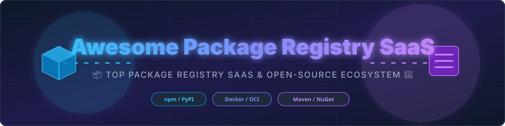

# 📦 Awesome Package Registry SaaS & Open-Source Tools 🚀

  

**Curated List of SaaS Platforms & Open-Source GitHub Projects for Package Registries & Artifact Repositories**

*Focused on Private Package Hosting, Artifact Repositories, Multi-Format Registries, Supply-Chain Security & Software Distribution.*

**Last updated: September 2026** 📅

---

## 💡 Overview & SEO Meta Summary

This curated directory provides a comprehensive comparison of **SaaS Package Registries** and **Open-Source Artifact Repositories**. Whether you are looking for zero-ops cloud hosting for npm, Maven, PyPI, NuGet, Docker/OCI, Go, Helm, and RubyGems, or production-grade self-hosted open-source alternatives, this guide covers commercial scale, pricing tiers, free quotas, and repository popularity.

---

## 📑 Table of Contents
- [📊 Market Overview & Industry Dynamics](#-market-overview--industry-dynamics)
- [☁️ SaaS/Hosted Platforms](#-saashosted-platforms)
- [🔓 Open-Source GitHub Projects](#-open-source-github-projects)
- [🛠️ Additional Open-Source Options & Architectures](#%EF%B8%8F-additional-open-source-options--architectures)
- [🤝 How to Contribute](#-how-to-contribute)
- [📈 Star History](#-star-history)
- [⚠️ Disclaimer](#%EF%B8%8F-disclaimer)

---

## 📊 Market Overview & Industry Dynamics

> [!NOTE]
> **Estimated Sector Market Size:** The global package registry, artifact repository, and software supply chain security market is estimated at **$2.5 Billion to $3.2 Billion (2026)**, expanding at a CAGR of ~18–22% driven by DevSecOps adoption, containerization, and enterprise compliance mandates.

> [!IMPORTANT]
> **Market Fragmentation:** The sector is **moderately fragmented**, exhibiting a dual-tier structure:
> 1. **Hyperscaler & Forge Consolidation:** Cloud leaders (AWS, Azure) and developer platforms (GitHub, GitLab) capture high volume through ecosystem integration.
> 2. **Specialized Best-of-Breed Registries:** Dedicated SaaS vendors (e.g., Cloudsmith, Packagecloud) and open-source giants (Harbor, Sonatype Nexus) thrive by offering multi-cloud portability, advanced compliance, fine-grained access control, and zero vendor lock-in.

---

## ☁️ SaaS/Hosted Platforms

*Commercial platforms ranked in **descending order by company size** (Revenue / Valuation).*

| 🚀 Product | 📝 Description | 📊 Company Size (Revenue / Valuation) | 💵 Pricing | 🎁 Free Tier Limits |
| :--- | :--- | :--- | :--- | :--- |
| **[Azure Artifacts](https://azure.microsoft.com/en-us/products/devops/artifacts)** | Azure DevOps package management supporting NuGet, npm, Maven, Python, and Universal Packages with feed views and upstream sources. | **$331.8 Billion** / $3.1T Valuation (Microsoft FY26 Revenue) | First 2 GiB free Next 2–10 GiB: $2/GiB/month | 2 GiB free storage per organization |
| **[AWS CodeArtifact](https://aws.amazon.com/codeartifact/)** | Fully managed artifact repository service compatible with npm, Maven, PyPI, NuGet, and Go, with upstream proxying across AWS accounts. | **$169.0 Billion** (AWS FY26 Annualized Revenue Run Rate) | Pay-as-you-go: $0.05/GB-month storage $0.05 per 10,000 requests | AWS Free Tier: 2 GB storage, 100,000 requests per month |
| **[GitHub Packages](https://github.com/features/packages)** | Integrated package registry tightly coupled with GitHub repositories & Actions, supporting npm, Maven, NuGet, Docker, RubyGems, etc. | **$2.0 Billion** (GitHub ARR / Microsoft Subsidiary) | Free for public packages Pro/Team: $4/user/month | GitHub Free (Private): 500 MB storage, 1 GB/month data transfer |
| **[Cloudsmith](https://cloudsmith.com/)** | Cloud-native, fully managed multi-format package registry focused on secure distribution, upstream proxying, and enterprise features. | **~$1.0 Billion Valuation** ($72M Series C Raised) | Core Plan: Free Pro Plan: Starts at $149/month | Core Plan: 500 MB storage, 1 GB/month download bandwidth |
| **[GitLab Package Registry](https://docs.gitlab.com/ee/user/packages/)** | Built-in package and container registry within GitLab, supporting multiple formats and seamless CI/CD integration. | **$1.1 Billion** (GitLab Annualized Revenue Run Rate) | Free Tier: $0/user/month GitLab Premium: $29/user/month | Free Tier: 10 GiB storage limit per project (up to 5 users/namespace) |
| **[Packagecloud](https://packagecloud.io/)** | Hosted package repository service supporting multiple formats with simple distribution and access control. | **Private / Acquired** (Acquired by Buildkite; est. $10M–$25M ARR) | Free Plan: $0 Starter Plan: Starts at $89/month | Free Plan: 2 GB storage, 10 GB/month bandwidth (public repositories) |
| **[ProGet](https://inedo.com/proget)** | Package and container management platform (self-hosted & cloud) with vulnerability scanning, feeds, and broad format support. | **Private / Bootstrapped** (Inedo LLC; est. $5M–$15M Revenue) | Free Edition: $0 Basic Plan: Starts at $2,395/year | Free Edition: Unlimited feeds & users (limited to 10 API deletes/hour) |
| **[Bytesafe](https://bytesafe.dev/)** | Security-focused package management and supply-chain platform for private registries and dependency protection. | **Private / Bootstrapped** (Bytesafe AB; est. $1M–$5M Revenue) | Cloud Plan: Starts at €99/month | 14-day free trial (Full feature access, no credit card required) |
| **[CloudRepo](https://cloudrepo.com/)** | Managed private Maven and Python package repositories with straightforward hosting and access controls. | **Private / Bootstrapped** (~$160k–$1M Estimated ARR) | Starter Plan: Starts at $199/month | Starter Plan: Starts at $199/month | 14-day free trial (No credit card required) |
| **[Gemfury](https://gemfury.com/)** | Private cloud package repository supporting multiple language ecosystems with simple push and install workflows. | **Private / Bootstrapped** (Cloudfury LLC; est. $100k–$500k ARR) | Personal Plan: Starts at $9/month | Public Plan: Free for unlimited public packages |

---

## 🔓 Open-Source GitHub Projects

*Self-hosted open-source repositories ranked in **descending order by GitHub Star Count**.*

- 🌟 **[Gitea](https://github.com/go-gitea/gitea)**   
  Painless self-hosted Git service with built-in package registry supporting npm, Maven, PyPI, NuGet, Cargo, Container/OCI, Helm, and more.

- 🌟 **[Harbor](https://github.com/goharbor/harbor)**   
  CNCF graduated open-source enterprise container registry that stores, signs, and scans OCI artifacts & Helm charts with RBAC and vulnerability scanning.

- 🌟 **[Verdaccio](https://github.com/verdaccio/verdaccio)**   
  Lightweight, popular open-source private npm proxy registry — easy to self-host, cache public packages, and publish private Node.js modules.

- 🌟 **[Athens](https://github.com/gomods/athens)**   
  Open-source Go module proxy and artifact registry providing immutability, security, and private module caching.

- 🌟 **[Forgejo](https://github.com/forgejo/forgejo)**   
  Community-managed soft-fork of Gitea offering an integrated multi-format package registry alongside git repository management.

- 🌟 **[BaGet](https://github.com/loic-sharma/BaGet)**   
  Open-source, lightweight .NET Core implementation of a NuGet server for self-hosting private C# / .NET packages.

- 🌟 **[Nexus Repository OSS](https://github.com/sonatype/nexus-public)**   
  Open-source core of Sonatype Nexus Repository supporting Maven, npm, Docker, PyPI, NuGet, Helm, RubyGems, and Raw repositories.

- 🌟 **[Dragonfly](https://github.com/dragonflyoss/Dragonfly2)**   
  CNCF open-source P2P-based image and artifact distribution system to accelerate container registry downloads at extreme scale.

- 🌟 **[devpi](https://github.com/devpi/devpi)**   
  Powerful open-source PyPI-compatible server, staging, and caching proxy for Python packages with release automation.

- 🌟 **[Pulp Core](https://github.com/pulp/pulpcore)**   
  Flexible open-source software repository management platform with plugins for RPM, Debian, PyPI, Ansible, Containers, and Maven.

- 🌟 **[kkRepo](https://github.com/klboke/kkRepo)**   
  Community-driven multi-format artifact repository supporting Maven, npm, PyPI, Go, Helm, Docker, Cargo, and NuGet with migration support.

- 🌟 **[Artifact Keeper](https://github.com/artifact-keeper/artifact-keeper)**   
  Modern high-performance Rust-based open-source artifact repository aiming for multi-format binary management with minimal overhead.

---

## 🛠️ Additional Open-Source Options & Architectures

- 🐳 **Harbor:** Recommended standard for OCI container images and Helm charts with vulnerability scanning (Trivy).
- ⚡ **Verdaccio:** Recommended for lightweight Node.js/npm module hosting and CI pipeline caching.
- 📦 **Nexus OSS / Pulp:** Recommended for enterprise multi-language artifact storage in complex self-hosted infrastructure.
- 🦊 **Gitea / Forgejo:** Recommended for all-in-one Git + Package registry hosting for small to medium engineering teams.
- 🌐 **Athens / devpi / BaGet:** Recommended for language-specific proxying and internal mirror requirements.

---

## 🤝 How to Contribute

1. 🍴 Fork the repository.
2. 📝 Add or edit entries in `README.md` following the standard table or list format.
3. 🔗 Ensure all product links, descriptions, pricing, and GitHub links are accurate and up-to-date.
4. 📬 Submit a Pull Request (PR) with a brief summary of additions!

---

## 📈 Star History

---

## ⚠️ Disclaimer

- This repository is a **community-curated** list intended for educational and technical comparison purposes.
- Package registries form a critical component of software supply chain security. Always verify access controls, signature verification, and security patching when deploying self-hosted solutions.

---

**Made with ❤️ for DevOps, Platform Engineers, and DevSecOps Teams worldwide.** 🌍

